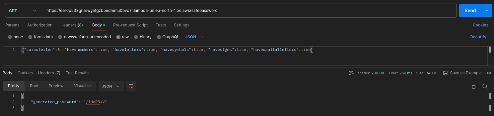

# Cybersecurity-Safe-Password-Generator
API created using FastAPI to generate safe passwords based on users' choice.

Stop using silly and obvious passwords, for your safety use something out of the box!
Just make a JSON request to the end point and get the generated password for your needs.

The body request should have:

The image shows a test in Postman

The minimum length for a password is 8!!!

It is deployed on AWS: http://54.243.5.214/ \
Endpoint: http://54.243.5.214/safepassword \
Its documentation: http://54.243.5.214/docs 
